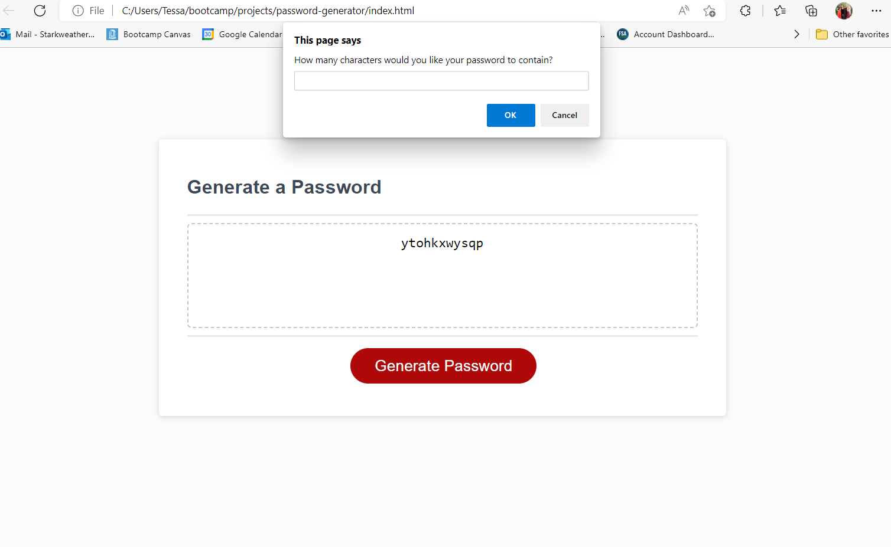
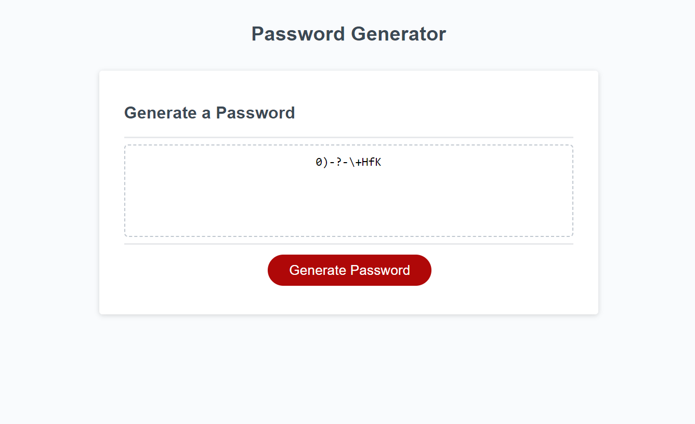

# password-generator

## Description
This application enables users to generate random passwords based on criteria that they’ve selected. This app runs in the browser and features dynamically updated HTML and CSS powered by JavaScript code. It has a clean and polished, responsive user interface that adapts to multiple screen sizes.

## Visuals

## Usage
* You can access this web application at the following link : 
[Password Generator](https://t-starkw.github.io/password-generator/)

* After clicking the red 'Generate Password' button, you will be prompted to enter the desired length of your password, as well as approve desired character types by clicking the 'OK' button.

* Once you have cycled through all of the confirmation prompts, your new password will appear in the box!

## License
N/A